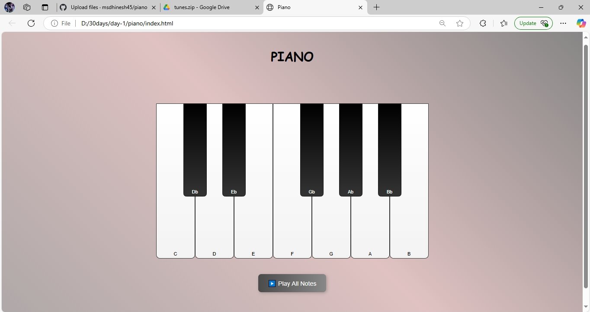

# 🎹 Piano Web App

This is a simple and interactive piano web application built using HTML, CSS, and JavaScript.

View:
[Piano ](https://my-piano.vercel.app/)

---

## 📷 Output Screenshot

---

## 🚀 Features

- 🎼 Click on piano keys to play musical notes
- 📝 Records the sequence of key presses
- ▶️ Replay the recorded melody using "Play" button
- 📱 Simple and responsive layout

---

1) clone the repo
      ## git clone https://github.com/msdhinesh45/piano.git
2. Open the `index.html` file in your browser.

3. Enjoy playing piano 🎹

---

## 🙋‍♂️ Author

**Dhinesh Kumar**  
GitHub: [@msdhinesh45](https://github.com/msdhinesh45)

---

